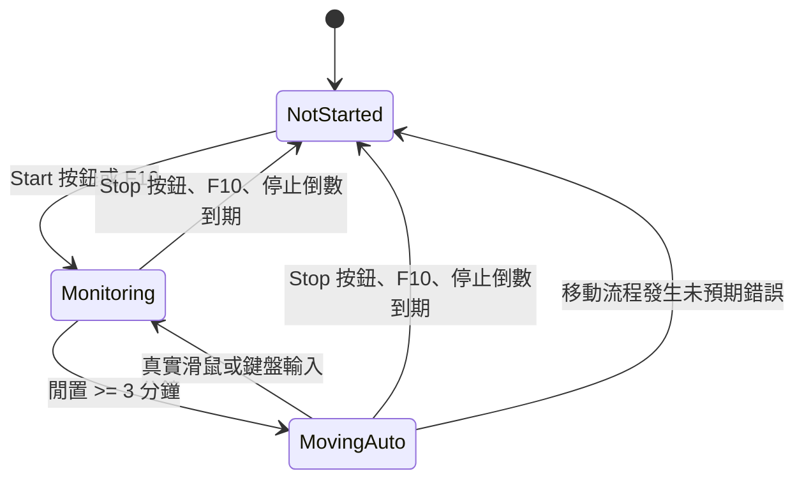

# MouseMoverApp 重建規格：功能與狀態

> 基準：2026-10-01 的 `D:\MouseMoverApp` 工作目錄。以當前工作檔案為準，不以 Git HEAD 為準；原工作目錄含尚未提交的 UI、路徑及輸入偵測修改。本文件描述**目前實際程式行為**，讓新實作盡量逐項一致。UI 見 [02-UI-SPEC.md](02-UI-SPEC.md)，路徑見 [03-MOVEMENT-SPEC.md](03-MOVEMENT-SPEC.md)，平台與驗收見 [04-PLATFORM-QA.md](04-PLATFORM-QA.md)。

## 1. 產品用途與操作入口

這是 Windows 桌面常駐小視窗 `AZu Sanpo`。使用者按 `Start (F10)` 或系統全域熱鍵 `F10` 後，程式開始監看真實滑鼠／鍵盤輸入。連續三分鐘無使用者輸入便自動將游標依 AZKi 圖案移動、點擊一次左鍵，等待 60 秒後重複。移動期間一旦出現真實使用者輸入，立即取消當前移動、進入監看狀態；再次連續閒置三分鐘便恢復移動。按 `Stop (F10)` 或 F10 會整體停止。

啟動程式時不自動開始監看。沒有設定儲存、系統匣、模式選單或暫停按鈕。`Random` 策略存在程式內，但目前使用者看不到切換入口；編譯常數選擇 `AZKi`。

## 2. 狀態模型

| 邏輯狀態 | `isIdleMonitoring` | `isMouseMoving` | 按鈕 | 顯示狀態 | 指示燈 |
| --- | ---: | ---: | --- | --- | --- |
| 完全停止 | false | false | `Start (F10)` | `Not Started` | Gray `#808080` |
| 閒置監看 | true | false | `Stop (F10)` | `Monitoring` | LimeGreen `#32CD32` |
| 自動移動 | true | true | `Stop (F10)` | `Moving (Auto)` | Red `#FF0000` |
| 達門檻瞬間 | true | false | `Stop (F10)` | `Auto Start` | OrangeRed `#FF4500` |
| 手動移動內部分支 | false | true | `Stop (F10)` | `Moving (Manual)` | OrangeRed `#FF4500` |

目前 UI 的 Start 和 F10 **只啟動閒置監看**，不直接進入 `Moving (Manual)`。`Auto Start` 是觸發時短暫更新，隨即被 `Moving (Auto)` 覆蓋；它通常不會停留一整個計時週期。使用者所說的「IDLE 模式」在這個 UI 上顯示為 `Monitoring`，沒有字面上的 `IDLE` 標籤。

### 狀態轉移

按鈕和 F10 共用 toggle 規則：只有在「未移動且未監看」時啟動監看；其餘狀態一律完全停止。因此處於 `Monitoring` 時按 F10 不會立即開始移動。監看已啟動時再按 Start 不會疊加第二個監看流程。

## 3. 閒置時間與輸入判定

- 門檻固定 `TimeSpan.FromMinutes(3)`，狀態計時器是 WinForms UI timer，每 `1000 ms` tick 一次。到門檻的實際開始時間受 tick 排程影響，約在下一次 tick 觸發；手動啟動監看時也會立即執行一次判定。
- 第一次啟動監看時，以 Win32 `GetLastInputInfo` 取得這個 Windows session 的既有閒置時間，推算初始 `lastUserInputTick = Environment.TickCount64 - idleMilliseconds`。若讀取失敗，初始閒置時間視為零。
- 監看期間以 `Environment.TickCount64 - lastUserInputTick` 計算閒置時間；不靠游標座標是否改變。每次真實輸入都把 `lastUserInputTick` 設成目前 tick，即使已處於監看中也會重新計算三分鐘。
- 使用 `WH_MOUSE_LL` 與 `WH_KEYBOARD_LL` 低階 hook 偵測真實滑鼠、鍵盤事件。凡事件結構的注入旗標 bit 0 為 1，直接忽略。程式自己的模擬點擊與程式設置游標座標不得讓計時重設或中斷移動。
- 使用者輸入到來時，若正移動：取消該輪 cancellation token，設 `isMouseMoving=false`、`startedByIdle=false`，保留 `isIdleMonitoring=true`，更新按鈕和閒置標籤；**停止倒數不重設**。若本來就在監看，只更新最後輸入 tick，不立即刷新標籤，下一個 UI tick 再更新。
- 若移動策略正在執行，取消需在其下個取消檢查或可取消等待點生效；完成策略後、點擊前另檢查一次取消。取消後不做該輪點擊。
- 啟動自動移動時把視窗還原為 Normal、顯示、啟用，並呼叫 `SetForegroundWindow`；即使先前失焦也會嘗試置前。

## 4. 移動循環

自動移動在背景 Task 執行，重複以下順序直到取消：

1. 依目前 `Screen.PrimaryScreen.Bounds` 建立策略參數；若無 primary screen，取 `Screen.FromControl(form).Bounds`。
2. 執行當前策略。現在固定為 `AZKi`，規格詳見第 03 份。
3. 再次檢查是否取消。
4. 在目前游標位置模擬一次滑鼠左鍵按下加放開。
5. 等待 `60000 ms`，再開始下一輪。

開始新移動輪時會取消並釋放舊 `CancellationTokenSource`，建立新的 token。正常取消不顯示錯誤。未預期例外在 UI 執行緒呼叫完整停止，並顯示標題 `MouseMoverApp`、內容 `Unexpected error:\r\n` 加上例外訊息、OK／Error 圖示的訊息框。

## 5. 停止倒數

停止倒數與三分鐘閒置門檻是**獨立功能**：控制項 `Stop countdown` 預設未勾選，分鐘預設 `180`，秒數預設 `0`。勾選後立即從當下計算截止時間，即使尚未按 Start；勾選時修改分鐘或秒數，從修改時刻重新倒數。取消勾選會清除截止時間。允許 `0 分 0 秒`，但此時沒有截止時間，顯示 `set > 00:00`。

| 操作／事件 | 實際結果 |
| --- | --- |
| 勾選且總秒數 > 0 | 設截止時間為現在 + 輸入時長，標籤每秒更新。 |
| 已勾選時修改任一數值 | 清除 Done 狀態，重新從完整設定時長計算。 |
| 取消勾選 | 清除截止時間，標籤 `Stop countdown: Off`。 |
| 按 Start，且已勾選 | 從 Start 時刻再重新計算整段時長。 |
| 倒數到期 | 先執行完整停止，保留 `Done`，顯示 `Stop countdown: Done`。 |
| 手動 Stop | 清除截止時間與 Done；若仍勾選且時長 > 0，顯示 `Ready`。 |
| 到期後再次 Start | 清除 Done，若有勾選則重新開始完整倒數。 |

每個 UI tick **先處理停止倒數，再判定閒置自動啟動**。到期的 tick 不應再先啟動一輪移動。停止倒數到期是完全停止，之後不會自行恢復監看或移動。

## 6. 生命週期與錯誤

- Form 建立時設定 `TopMost=true`。Form Load 再透過 `SetWindowPos(HWND_TOPMOST, SWP_NOACTIVATE | SWP_SHOWWINDOW)` 置頂。
- 視窗 handle 建立時註冊無修飾鍵的全域 F10；handle 銷毀時取消註冊。此實作沒有檢查熱鍵註冊是否成功，因此被其他程式占用時按鈕仍可用。
- Start 時先安裝兩個低階輸入 hook。若任一個安裝失敗，不進入監看；顯示 `Unable to monitor input:\r\n` 加 Windows 錯誤訊息的 Error 對話框。第二個失敗時先移除已裝的第一個。
- 完全停止時解除 hook、取消移動 token、清除監看及移動狀態、清除停止倒數截止時間，視需要清除 Done。
- 視窗關閉時解除 hook 並取消移動 token。沒有背景服務或視窗關閉後繼續運行的要求。
