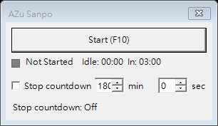

# MouseMoverApp 重建規格：UI 像素、文字與互動

> 與 [01-FUNCTIONAL-SPEC.md](01-FUNCTIONAL-SPEC.md) 配套。要做出最接近目前版本的畫面，優先沿用 Windows Forms 的原生控制項、預設系統色與繪製方式。以下座標以**視窗內容區左上角**為 `(0,0)`，單位為 WinForms 設計像素。

## 1. 原程式參考畫面



此 PNG 直接由 2026-10-01 當前程式的 Form 在繁體中文 Windows 環境中以 `DrawToBitmap` 產生，為初始狀態：監看未啟動、停止倒數未勾選、分鐘 180、秒 0。圖片包含非客戶區外框與標題列；適合視覺比對。實機螢幕截圖仍可能受 Windows 佈景、縮放比例及標題列版本影響。

## 2. 視窗本身

| 項目 | 規格 |
| --- | --- |
| 視窗標題 | `AZu Sanpo`；標題列只有右上角關閉鈕。 |
| Form 名稱 | `Form1`。 |
| 設計內容區 | `ClientSize = 290 × 138`。 |
| 當前測試機實際外框 | `306 × 177`；外框與標題列尺寸由 Windows 決定。 |
| 邊框 | `FormBorderStyle.FixedDialog`，不可拖曳縮放。 |
| 視窗按鈕 | `MaximizeBox=false`、`MinimizeBox=false`；保留 Close。 |
| 置頂 | Form `TopMost=true`，Load 時再以 Win32 設為 topmost。 |
| 縮放 | `AutoScaleMode.Font`，設計器 `AutoScaleDimensions=(7,15)`。 |
| 字型 | 未在 Designer 中指定個別 Font，繼承 Windows Forms 預設。當前測試機實測為 `Microsoft JhengHei UI 9pt`，所有控制項一致。若另一台電腦字型或 DPI 不同，像素與文字寬度可能有差異；追求像素一致時請以參考環境和圖為準。 |
| 色彩及外觀 | Form、按鈕、核取方塊、數值欄皆沿用 WinForms／Windows 預設色與 Visual Styles；不要加入自訂背景、圓角、陰影、圖示或動畫。 |
| 應用程式圖示 | 專案的 EXE 使用根目錄 `mouseIcon.ico`。Form 沒有另外指定 `Icon`。`mouseIcon.png` 是同根目錄的藍色滑鼠圖案資產，但目前 UI 沒有把它顯示在視窗內容區。 |

## 3. 控制項配置

所有 `Location`、`Size` 都源自 `Form1.Designer.cs`；`TabIndex` 也請照表建立，才能保留鍵盤巡覽順序。Designer 後面的括號是當前機器執行時觀察到、由 `AutoSize` 改變的尺寸。

| 順序／名稱 | 類型 | `(X,Y)` | 大小 `W×H` | 初始設定及顯示 |
| --- | --- | ---: | ---: | --- |
| 0 `btnToggle` | `Button` | `(8,8)` | `274×35` | `Start (F10)`；`UseVisualStyleBackColor=true`。 |
| 1 `pnlIdleLamp` | `Panel` | `(8,52)` | `12×12` | 背景 `Color.Gray`，`BorderStyle.FixedSingle`。 |
| 2 `lblIdleInfo` | `Label` | `(26,48)` | `256×18` | `Not Started    Idle: 00:00  In: 03:00`；`AutoSize=false`，`TextAlign=TopLeft`。 |
| 3 `chkStopCountdown` | `CheckBox` | `(8,80)` | Designer `111×25`；執行時約 `120×21` | `AutoSize=true`，預設未勾選；Designer 字串尾有空格，但 Load 時實際文字改為 `Stop countdown`。 |
| 4 `numStopMinutes` | `NumericUpDown` | `(125,78)` | `42×23` | 整數範圍 `0..999`，建構時設值 `180`。 |
| 5 `lblStopMinutes` | `Label` | `(170,82)` | Designer `28×15`；執行時約 `27×20` | 文字 `min`，`AutoSize=true`。 |
| 6 `numStopSeconds` | `NumericUpDown` | `(214,78)` | `42×23` | 整數範圍 `0..59`，預設 `0`。 |
| 7 `lblStopSeconds` | `Label` | `(259,82)` | Designer `24×15`；執行時約 `23×20` | 文字 `sec`，`AutoSize=true`。 |
| 8 `lblStopCountdown` | `Label` | `(8,112)` | `274×18` | `Stop countdown: Off`；`TextAlign=TopLeft`。 |

UI 結構是四橫列：第一列是滿寬按鈕；第二列是 12×12 指示燈與閒置狀態；第三列是核取方塊、分鐘輸入、`min`、秒輸入、`sec`；第四列是停止倒數文字。控件與視窗邊緣保留約 8 像素間隔。沒有選單、工具列、分頁、側欄、模式下拉選單或進度條。

## 4. 狀態列的精確文字

`lblIdleInfo` 每次更新均以如下字串連接，保留空格數量：

```text
{狀態字串} + "    Idle: " + {閒置 mm:ss} + "  In: " + {距離三分鐘 mm:ss}
```

其中狀態後是**四個空格**，`In:` 前是**兩個空格**。分鐘是整數總分鐘，以至少兩位數顯示，不按小時折算；秒數同樣兩位。負值先歸零。`In` 是 `max(0, 03:00 - idle)`；移動中通常是 `00:00`，但一旦發生使用者輸入就回 `Monitoring` 並重新顯示接近 `03:00`。

| 條件 | 狀態字串 | 指示燈背景 |
| --- | --- | --- |
| 尚未開始／手動停止／倒數到期 | `Not Started` | `Color.Gray`，RGB `128,128,128` |
| 等待使用者停止活動滿三分鐘 | `Monitoring` | `Color.LimeGreen`，RGB `50,205,50` |
| 目前自動移動 | `Moving (Auto)` | `Color.Red`，RGB `255,0,0` |
| 剛達門檻、準備啟動移動 | `Auto Start` | `Color.OrangeRed`，RGB `255,69,0` |
| 保留的內部手動移動分支 | `Moving (Manual)` | `Color.OrangeRed`，RGB `255,69,0` |

`Not Started` 狀態的 `Idle:` 是讀取系統最後輸入時間所得，並非固定為零。初始 Load 畫面先明確以零渲染；完全停止時會再計算一次。UI timer 只在監看中、移動中或停止倒數有截止時間時運作，完全停止後此字串通常不會持續刷新。

## 5. 停止倒數的精確文字與互動

`lblStopCountdown` 的文字只用下列五種形式：

| 條件，依程式判斷順序 | 顯示 |
| --- | --- |
| 核取方塊未勾選 | `Stop countdown: Off` |
| 已勾選且該次倒數完成 | `Stop countdown: Done` |
| 已勾選且有截止時間 | `Stop countdown: {mm:ss}` |
| 已勾選，但設定時長為 0 | `Stop countdown: set > 00:00` |
| 已勾選且設定時長 > 0，但沒有正在跑的截止時間 | `Stop countdown: Ready` |

預設停止倒數是 `Off`，雖然分鐘數輸入框顯示 `180`。使用者勾選或修改已勾選的數值就重新開始倒數；沒有獨立套用鍵。秒數上下箭頭採 `NumericUpDown` 原生外觀；分鐘與秒數輸入框始終可操作，沒有勾選時也不會禁用。

## 6. 互動與焦點

- 按主按鈕或 F10 會切換開始監看／完全停止，按鈕字串同步切換，沒有第三種按鈕文字。
- F10 是全域熱鍵，視窗未取得焦點時也要能操作；鍵盤焦點在視窗內時同樣適用。
- 自動開始移動時視窗會顯示、還原並嘗試取得前景焦點。此點可能讓 Windows 標題列顯示成作用中狀態，屬目前行為。
- 輸入 hook 安裝失敗及移動例外時顯示 Windows 原生 Error MessageBox；訊息內容見第 01 份。
- 對 UI 作逐像素驗收時，先將 Windows 主題、字型、DPI／顯示縮放及 OS 版本固定；本檔座標與圖片是主要參照，Windows 非客戶區外框可隨環境變動。
